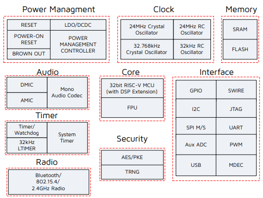

# [TLSR9218](https://doc.soc.xin/TLSR9218)

* [Telink](https://www.telink-semi.com/): [RISC-V](https://github.com/SoCXin/RISC-V)
* [L2R2](https://github.com/SoCXin/Level): 96 MHz

## [简介](https://github.com/SoCXin/TLSR9218/wiki)

[TLSR9218](https://github.com/SoCXin/TLSR9218) 是泰凌微电子最新一代低功耗高性能多协议无线连接SoC，在单芯片上支持蓝牙低功耗5.2，蓝牙Mesh，Zigbee 3.0，Apple HomeKit，Apple Find My network，Thread，Matter和2.4 GHz专有协议。

### 关键参数

* 96MHz RISC-V
* 256kB SRAM + 1/2 MB Flash
* USB + SPI + USART + IIC
* Tx output power: -24 to +10 dBm @ BLE mode
* Whole Chip, BLE TX mode, 6.6 mA @ 0 dBm, 3.3 V DCDC
* Whole Chip, BLE RX mode: 6.1 mA @ 3.3 V DCDC
* Deep sleep with external wakeup (without SRAM retention, without 32K RC): 0.7 µA

## [资源收录](https://github.com/SoCXin)

* [参考资源](src/)
* [参考文档](docs/)
* [参考工程](project/)

## [选型建议](https://github.com/SoCXin/TLSR9218)

[TLSR9218](http://www.telink-semi.cn/products/multiprotocol-iot/) 是上海张江 [Telink](https://www.telink-semi.com/) 最新一代无线SoC，相似无线产品还包括TLSR827x/TLSR826x/TLSR825x/TLSR823x等系列，整体上都是围绕2.4G BLE功能和低功耗应用。

相关开发板购买可访问 [官方淘宝店](https://shop321349797.taobao.com/index.htm?spm=a1z10.3-c.w5002-24452846213.2.b2024315ryCAKL)

### [www.SoC.xin](http://www.SoC.Xin)
